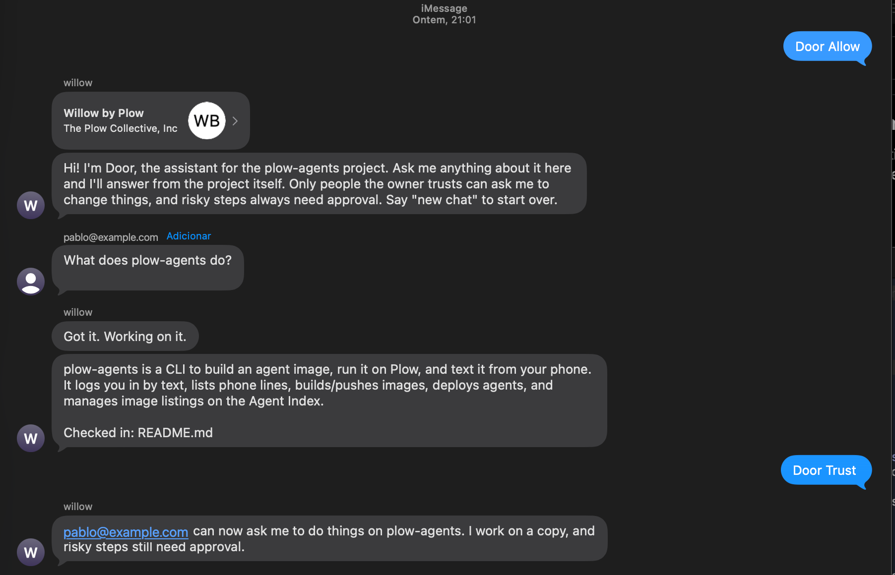
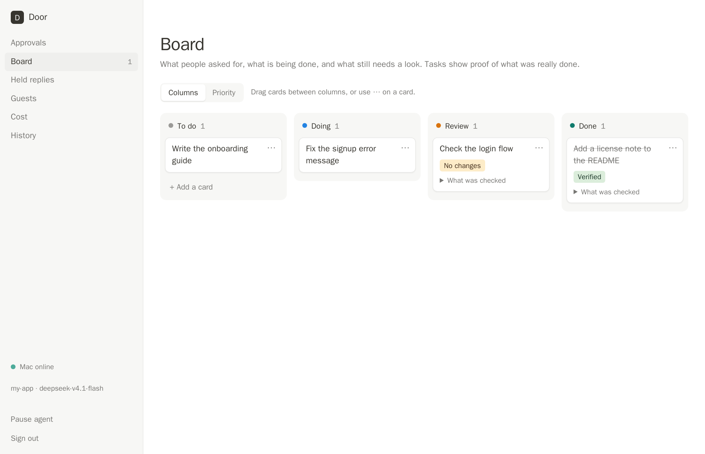
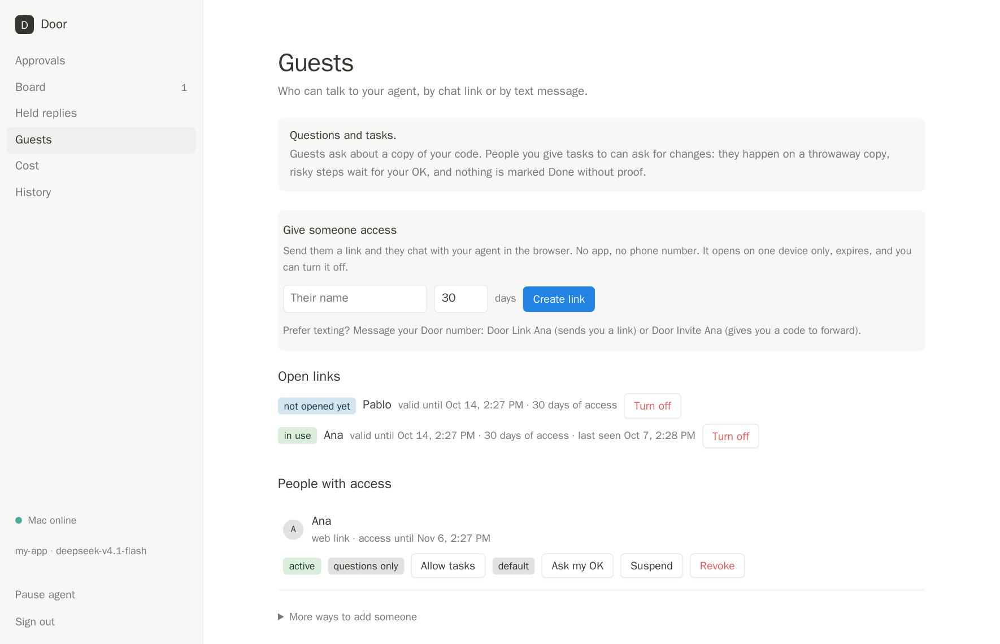
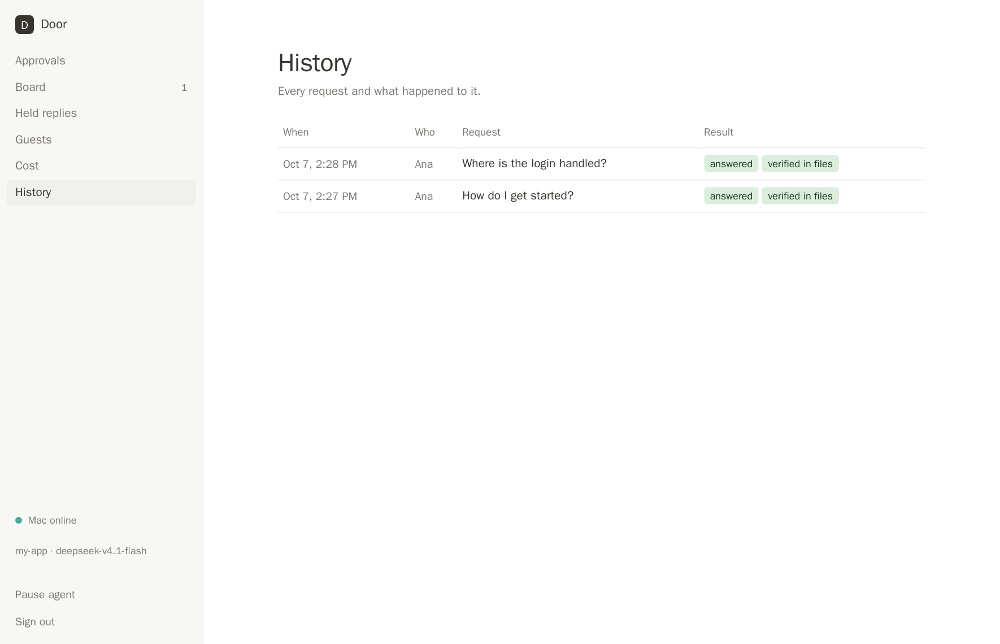
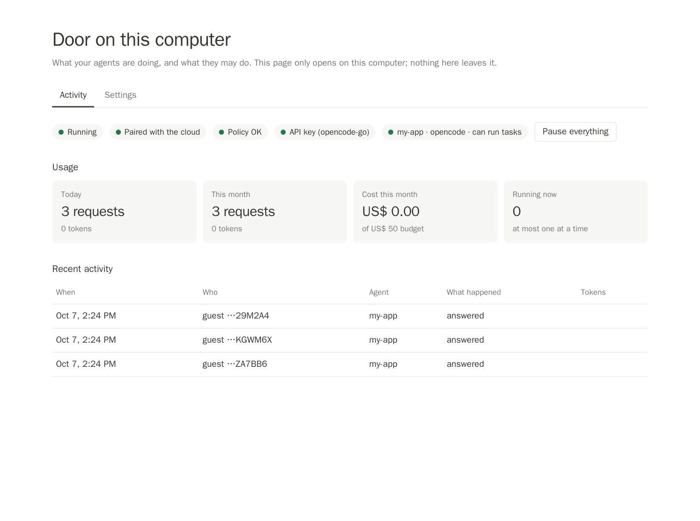
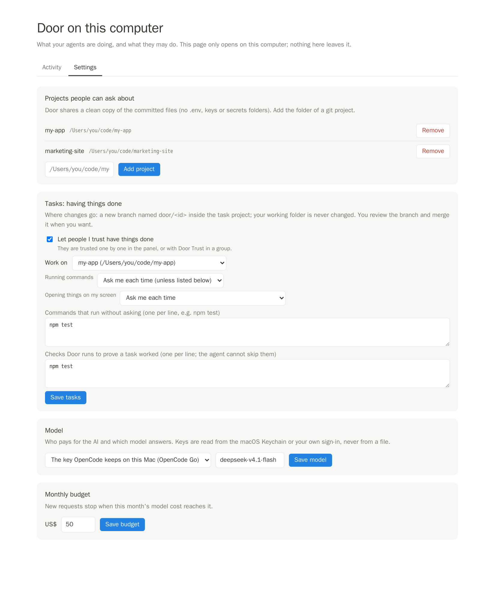

# Door

**English** · [Português](#português)

**Let people talk to the AI that works on your code.** They text it, add it to a group chat, or open a link. It answers from your project
and, for the people you trust, it does the work and proves it was done.

### What you get
- **Answers from your own project.** Anyone you let in can ask how something works. Door replies from the project's files and says which
  ones it checked.
- **Work done, with proof.** People you trust can ask for changes. They happen on a throwaway copy, risky steps wait for your OK, and a card
  reaches *Done* only when something really changed, your own checks passed and an independent check agrees.
- **Your computer stays closed.** Nothing connects in. Nobody gets a shell, your files or your keys.
- **You stay in charge.** Limits per person, a monthly budget, a pause button, and a log of everything that ran, kept on your Mac.

### See it
Example data, not a real project (the iMessage conversation is real, with a friend's address replaced by a fictional one).

**In iMessage.** You add the Door number to a group and text `Door Allow`. Door introduces itself; people ask; Door answers from the project
and names the files it checked. `Door Trust` lets someone have things done, once you confirm in your private chat. (The introduction has
since been reworded to explain how to talk to Door: start a message with "Door,".)



In a group, people talk to each other and Door stays quiet until it is addressed:

```
 Pablo   did you see the game?                        (Door says nothing)
 Ana     Door, how do I get started?
 Door    Install the dependencies with npm install, copy .env.example to .env and run npm run dev.
         Checked in: README.md, package.json
 Ana     Door, add a license note to the README       (Ana was trusted with tasks, so it is done as a task)
 Door    Got it. I'll do this and check the result.
```

No texting? People can use a **chat link** in the browser instead: no app, no account, one device per link.

**Your panel.** Every request becomes a card. A card moves to *Done* only with proof; "No changes" and failed checks go to *Review*.



You decide who is in, with limits per person, and you see every request and its result.





**On your own Mac**, a page that only opens there shows what ran and what it cost, and holds the settings: which projects are shared,
what tasks may do, the model and the budget.





### How it works
```
 Someone texts your Door number, opens a chat link, or talks in a group
        │   (Plow carries the text messages)
        ▼
 Door cloud agent: rules, limits, who may do what, your panel and board
        │   Plow relay ──► Plow Latch on your Mac (your Mac only ever dials out)
        ▼
 door-host on your Mac: checks every request again
        ├─ questions: an isolated container reads a clean copy of the project; the model key never enters it
        └─ tasks: Claude Code works on a throwaway git branch; risky steps wait for you; Door runs YOUR checks
        ▼
 The answer (or the result and its proof) goes back the same way
```
[Plow](https://plow.co) provides the phone line (SMS and iMessage, including groups) and runs the cloud part; **Plow Latch** is the app on your
Mac that connects it to Plow, by an outbound connection only.

### Who can do what
| | Ask questions | Have things done | Risky steps | Change settings |
|---|---|---|---|---|
| **You** | Yes, in plain words | Yes: anything that is not a question is a task, and it runs without asking you again | Dangerous ones are always refused | Yes |
| **People you trust** | Yes | Yes, on a throwaway copy; "create a file…", "fix…" is enough | Wait for your OK by text | No |
| **Anyone else you let in** | Yes | No | No | No |

Dangerous commands, secret files and anything outside the project copy are refused for everyone. If you ask Door to show you something on
your screen, it checks that a window really appeared before calling it done.

### Getting people in
`Door Link Ana` (a chat link that opens on one device and expires) · `Door Invite Ana` (a code to text) · in a group, `Door Allow` (Door
introduces itself) and `Door Trust` (lets them have things done, after you confirm in your private chat). **In a group Door answers only when
it is addressed**: start a message with "Door," or "@door".

### What you control
- **The panel**: board with a priority view, guests and links, history, cost, and **Settings**.
- **Door on this computer** (a page that only opens on your Mac): what ran and what it cost, steps waiting for your OK, and the same
  settings, plus a folder picker and guided sign-in.
- **Settings, from anywhere.** Budget and model apply at once. Adding or removing a project, and what tasks may do, wait for your YES by
  text, and your Mac checks every change again. The cloud only ever sees project names, never folder paths.

### Set it up
1. On your Mac: `curl -fsSL <where you host it>/install.sh | bash`. It installs Plow Latch if missing, Door and its isolated runner, and asks
   three questions (project, model, tasks). `door-host doctor` tells you anything still missing.
2. In the cloud: run the Door image on one of your Plow lines (`plow-agents deploy --local --line ln_xxx`, or publish it on Plow).
3. Text the line `Door Activate: <code>`, then `Door Pair: <code>`. Done.

### Built on MyPeople and Plow
Door joins two things. **MyPeople** (the runtime of [MyPlow](MYPLOW.md)) runs agent teams on your own machine: a Boss that routes work, a
priorities board, and "proof" that work was really done. **Plow** gives an agent a phone line. Door brings the MyPeople ideas to people
*outside* your machine.

Door is its own program: **it does not import or run any MyPeople code and does not need MyPeople installed.** It follows MyPeople's ideas
and the way MyPeople talks to Plow. This repository keeps the MyPeople parts it builds on:

| In MyPeople | What Door takes from it |
|---|---|
| `mypeople/runtime/plugins/plow-chat` (the Plow Chat bridge) | How an agent talks to Plow: the cloud-agent contract (`/v1/agents/cloud/me`), chats and groups, answering in the thread that asked. Door's [`plow.py`](door/door/plow.py) and [`plow_agent.py`](door/door/plow_agent.py) follow the same pattern. |
| `cloud/` (the cloud image) | How an agent image boots on a Plow line with no secrets inside. Door's [`cloud/Dockerfile`](door/cloud/Dockerfile) takes the same approach. |
| The Boss and engineers (`mypeople/runtime/mp-boss-doctrine.md`) | One agent decides who works on what. Door's "Boss" picks which agent answers; tasks go to a separate task agent. |
| The priorities board | Door's board: each request is a card that moves from To do to Done. |
| `mypeople/runtime/verify/` and "proof" | Door's rule that work is Done only with evidence. |
| Plow Latch | MyPeople already uses Latch to reach a Mac; Door reaches your Mac through the same Latch. |

The rest of this repository is MyPeople itself: the runtime (`mypeople/`), the desktop app (`desktop/`), the cloud image (`cloud/`),
`install.sh` and `docs/HOW-IT-WORKS.md`. Its original README is [`MYPLOW.md`](MYPLOW.md). Door's own code is in `door/`.

### Status
Tested on a real Plow account (October 2026): activation and pairing by text, the image running on a Plow line, the Latch relay to the Mac,
questions answered by a real model in 20 to 30 seconds, a group chat with a second person, tasks done by the real Claude Code, and the
settings. What is not verified yet: [`READINESS.md`](door/docs/READINESS.md).

### What is left to finish
**Needs a decision or an account (not code)**
1. **A public address for the links.** Today they open only on the owner's Mac. Put the cloud part on a server with a domain and HTTPS.
2. **Publish the image** publicly (amd64) and ask Plow to list it in the agent index, so a customer can install it in one click. Decide the
   product name first: it becomes the public identifier.
3. **Terms, privacy policy, licence and pricing.** Billing is manual for now.

**Needs more work**
4. **Choose which project a conversation is about.** Several projects can be shared, but a person cannot yet pick one or be limited to one.
5. **Door's own text messages in both languages.** The guest chat page and the group introduction speak English and Portuguese; most other
   messages are English (the catalog is written in `door/i18n.py`, not wired in yet).
6. **The owner panel in Portuguese.**
7. **Faster answers.** Typically 20 to 30 seconds, mostly the model's slowest call.

**Still to test for real**
8. The installer on a **second Mac**, including downloading Plow Latch.
9. A trusted guest's task with the approval arriving by text, end to end on Plow.
10. **Own-subscription sign-in** and **Codex** (needs the owner's decision on its inner sandbox).
11. **Load**: one panel process serves tens of customers, not thousands.

**[Full Door reference: how it works, the engines, the board, the tests →](door/README.md)**
**[The MyPeople runtime in this repository (what Door is modelled on) →](MYPLOW.md)**

---

## Português

**Deixe as pessoas conversarem com a IA que trabalha no seu código.** Elas mandam mensagem, colocam o Door num grupo ou abrem um link. Ele
responde a partir do seu projeto e, para quem você confia, faz o trabalho e prova que foi feito.

### O que você ganha
- **Respostas do seu próprio projeto.** Quem você deixar entrar pode perguntar como algo funciona. O Door responde a partir dos arquivos do
  projeto e diz quais conferiu.
- **Trabalho feito, com prova.** Quem você confia pode pedir mudanças. Elas acontecem numa cópia descartável, passos arriscados esperam o seu
  OK, e um cartão só chega em *Done* quando algo mudou de verdade, as suas verificações passaram e uma checagem independente concorda.
- **Seu computador continua fechado.** Nada se conecta nele. Ninguém recebe terminal, seus arquivos ou suas chaves.
- **Você continua no comando.** Limites por pessoa, orçamento do mês, botão de pausar e um registro de tudo que rodou, guardado no seu Mac.

### Veja funcionando
Dados de exemplo, não um projeto real (a conversa do iMessage é real, com o endereço de um amigo trocado por um fictício).

**No iMessage.** Você coloca o número do Door num grupo e manda `Door Allow`. O Door se apresenta; as pessoas perguntam; o Door responde a
partir do projeto e diz os arquivos que conferiu. `Door Trust` libera alguém para pedir tarefas, depois que você confirma no seu privado. (A
apresentação mudou desde esse print, para explicar como falar com o Door: começar a mensagem com "Door,".)


Num grupo, as pessoas conversam entre si e o Door fica quieto até ser chamado:

```
 Pablo   viu o jogo ontem?                            (o Door não diz nada)
 Ana     Door, como eu começo a usar?
 Door    Instale as dependências com npm install, copie .env.example para .env e rode npm run dev.
         Conferido em: README.md, package.json
 Ana     Door, coloca uma nota de licença no README   (a Ana foi liberada para tarefas, então vira tarefa)
 Door    Entendi. Vou fazer isso e conferir o resultado.
```

Sem SMS? As pessoas podem usar um **link de chat** no navegador: sem app, sem conta, um aparelho por link.

**O seu painel.** Cada pedido vira um cartão. O cartão só vai para *Done* com prova; "No changes" e verificações que falharam vão para *Review*.


Você decide quem entra, com limites por pessoa, e vê cada pedido e o resultado.


**No seu próprio Mac**, uma página que só abre ali mostra o que rodou e quanto custou, e guarda as configurações: quais projetos são
compartilhados, o que as tarefas podem fazer, o modelo e o orçamento.


### Como funciona
```
 Alguém manda mensagem para o seu número do Door, abre um link de chat ou fala num grupo
        │   (o Plow leva as mensagens de texto)
        ▼
 Agente do Door na nuvem: regras, limites, quem pode o quê, seu painel e quadro
        │   relay do Plow ──► Plow Latch no seu Mac (o seu Mac só faz conexões de saída)
        ▼
 door-host no seu Mac: confere cada pedido de novo
        ├─ perguntas: um contêiner isolado lê uma cópia limpa do projeto; a chave do modelo nunca entra nele
        └─ tarefas: o Claude Code trabalha numa branch git descartável; passos arriscados esperam você; o Door roda as SUAS verificações
        ▼
 A resposta (ou o resultado e a prova) volta pelo mesmo caminho
```
O [Plow](https://plow.co) fornece a linha de telefone (SMS e iMessage, inclusive grupos) e roda a parte na nuvem; o **Plow Latch** é o app no seu
Mac que o liga ao Plow, só por conexão de saída.

### Quem pode o quê
| | Perguntar | Pedir tarefas | Passos arriscados | Mudar configurações |
|---|---|---|---|---|
| **Você** | Sim, em palavras normais | Sim: o que não for pergunta vira tarefa, e roda sem pedir autorização de novo | Os perigosos são sempre recusados | Sim |
| **Quem você confia** | Sim | Sim, numa cópia descartável; "cria um arquivo…", "corrige…" basta | Esperam o seu OK por mensagem | Não |
| **Qualquer outra pessoa que você deixar entrar** | Sim | Não | Não | Não |

Comandos perigosos, arquivos de chaves e qualquer coisa fora da cópia do projeto são recusados para todos. Se você pedir para o Door mostrar
algo na sua tela, ele confere que uma janela realmente apareceu antes de dar como feito.

### Como as pessoas entram
`Door Link Ana` (link de chat que abre em um aparelho e vence) · `Door Invite Ana` (código para mandar por SMS) · num grupo, `Door Allow` (o
Door se apresenta) e `Door Trust` (libera tarefas, depois que você confirma no seu privado). **Num grupo o Door só responde quando é
chamado**: comece a mensagem com "Door," ou "@door".

### O que você controla
- **O painel**: quadro com visão de prioridade, convidados e links, histórico, custo e **Settings**.
- **Door on this computer** (uma página que só abre no seu Mac): o que rodou e quanto custou, passos esperando o seu OK e as mesmas
  configurações, com seletor de pastas e login guiado.
- **Settings, de qualquer lugar.** Orçamento e modelo valem na hora. Adicionar ou remover um projeto, e o que as tarefas podem fazer, esperam
  o seu YES por mensagem, e o seu Mac confere cada mudança de novo. A nuvem só vê os nomes dos projetos, nunca os caminhos das pastas.

### Como instalar
1. No Mac: `curl -fsSL <onde estiver hospedado>/install.sh | bash`. Instala o Plow Latch se faltar, o Door e o ambiente isolado, e faz três
   perguntas (projeto, modelo, tarefas). `door-host doctor` diz o que ainda falta.
2. Na nuvem: rode a imagem do Door numa linha do Plow (`plow-agents deploy --local --line ln_xxx`, ou publicando no Plow).
3. Mande para a linha `Door Activate: <código>` e depois `Door Pair: <código>`. Pronto.

### Feito sobre o MyPeople e o Plow
O Door junta duas coisas. O **MyPeople** (o motor do [MyPlow](MYPLOW.md)) roda times de agentes na sua máquina: um Boss que distribui o
trabalho, um quadro de prioridades e a "prova" de que o trabalho foi feito. O **Plow** dá uma linha de telefone a um agente. O Door leva as
ideias do MyPeople para pessoas *de fora* da sua máquina.

O Door é um programa próprio: **ele não importa nem executa código do MyPeople e não precisa do MyPeople instalado.** Ele segue as ideias do
MyPeople e o jeito como o MyPeople conversa com o Plow. Este repositório guarda as partes do MyPeople em que ele se baseia:

| No MyPeople | O que o Door aproveita |
|---|---|
| `mypeople/runtime/plugins/plow-chat` (a ponte do Plow Chat) | Como um agente fala com o Plow: o contrato de agente na nuvem (`/v1/agents/cloud/me`), chats e grupos, responder na conversa de onde veio a pergunta. O [`plow.py`](door/door/plow.py) e o [`plow_agent.py`](door/door/plow_agent.py) do Door seguem o mesmo padrão. |
| `cloud/` (a imagem da nuvem) | Como a imagem de um agente sobe numa linha do Plow sem nenhum segredo dentro. O [`cloud/Dockerfile`](door/cloud/Dockerfile) do Door segue a mesma abordagem. |
| O Boss e os engenheiros (`mypeople/runtime/mp-boss-doctrine.md`) | Um agente decide quem trabalha em quê. O "Boss" do Door escolhe qual agente responde; as tarefas vão para um agente de tarefas separado. |
| O quadro de prioridades | O quadro do Door: cada pedido é um cartão que anda de To do até Done. |
| `mypeople/runtime/verify/` e a "prova" | A regra do Door de que o trabalho só está Done com evidência. |
| Plow Latch | O MyPeople já usa o Latch para chegar a um Mac; o Door chega ao seu Mac pelo mesmo Latch. |

O resto deste repositório é o próprio MyPeople: o motor (`mypeople/`), o app de desktop (`desktop/`), a imagem da nuvem (`cloud/`), o
`install.sh` e o `docs/HOW-IT-WORKS.md`. O README original é o [`MYPLOW.md`](MYPLOW.md). O código do Door fica em `door/`.

### Situação
Testado numa conta Plow de verdade (outubro de 2026): ativação e pareamento por SMS, a imagem rodando numa linha do Plow, a ponte do Latch até
o Mac, perguntas respondidas por um modelo real em 20 a 30 segundos, um grupo com uma segunda pessoa, tarefas feitas pelo Claude Code de
verdade e as configurações. O que ainda não foi verificado: [`READINESS.md`](door/docs/READINESS.md).

### O que falta finalizar
**Precisa de decisão ou de conta (não é código)**
1. **Um endereço público para os links.** Hoje só abrem no Mac da dona. Colocar a parte da nuvem num servidor com domínio e HTTPS.
2. **Publicar a imagem** (amd64) e pedir ao Plow para listá-la no índice de agentes, para o cliente instalar com um clique. Decida antes o nome
   do produto: ele vira o identificador público.
3. **Termos, política de privacidade, licença e preço.** A cobrança é manual por enquanto.

**Falta trabalho**
4. **Escolher sobre qual projeto é a conversa.** Dá para compartilhar vários, mas a pessoa ainda não escolhe um nem fica limitada a um só.
5. **As mensagens do próprio Door nos dois idiomas.** A página de chat do convidado e a apresentação do grupo falam inglês e português; a
   maioria das outras mensagens é em inglês (o catálogo está em `door/i18n.py`, ainda não ligado).
6. **O painel da dona em português.**
7. **Respostas mais rápidas.** Normalmente 20 a 30 segundos, principalmente a chamada mais lenta do modelo.

**Ainda falta testar de verdade**
8. O instalador num **segundo Mac**, inclusive baixando o Plow Latch.
9. A tarefa de um convidado de confiança com a aprovação chegando por SMS, de ponta a ponta no Plow.
10. **Login com a própria assinatura** e **Codex** (precisa da decisão da dona sobre o isolamento interno dele).
11. **Carga**: um processo de painel serve dezenas de clientes, não milhares.

**[Referência completa do Door: como funciona, os motores, o quadro, os testes →](door/README.md#português)**
**[O motor MyPeople neste repositório (em que o Door se baseia) →](MYPLOW.md)**
