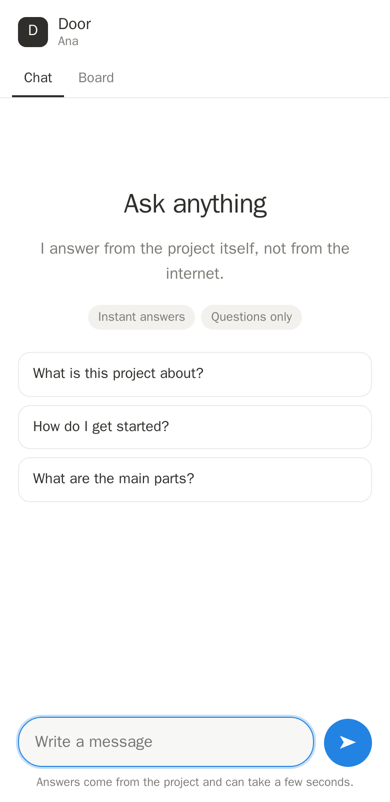
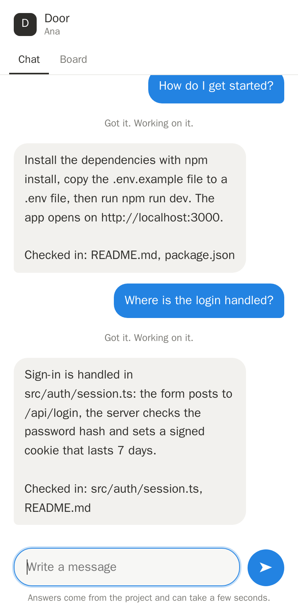

# Door

**English** · [Português](#português)

Door lets other people talk to the AI agent that works on your code: **by text message, in a group chat, or through a chat link**.
They ask questions and get answers from the project itself. People you trust can also ask for things to be done, and Door proves the
work was really done before it calls it finished. Your computer never opens a port, and nobody gets a shell, your files or your keys.

### What Door is made of
Door joins two things:
- **MyPeople** (the runtime of [MyPlow](../MYPLOW.md)): agent teams on your own machine with a Boss that routes work, a priorities board,
  and "proof" that work was really done. Door brings these ideas to people *outside* your machine: the board where requests become cards,
  the Boss that picks which agent answers, and delivery checked by evidence instead of by trust.
- **[Plow](https://plow.co)**: a phone line for the agent (SMS and iMessage, including group chats), a place to run the cloud part as a
  Plow cloud agent, and **Plow Latch**, the app on your Mac that connects it to Plow by an outbound connection only.

```
 Someone texts your Door number / writes in a chat link / talks in a group
        │   (Plow carries the text messages)
        ▼
 Door cloud agent: rules, limits, who may do what, your panel, the board
        │   Plow relay ──► Plow Latch on your Mac (your Mac only dials out)
        ▼
 door-host on your Mac: checks every request again (signed by the cloud)
        ├─ questions: an isolated container reads a clean copy of the project; the model key never enters it
        └─ tasks: Claude Code works on a throwaway git branch; risky steps wait for you; Door runs YOUR checks
        ▼
 The answer (or the result and its proof) goes back the same way
```

### Door and MyPeople: what is shared and what is not
Door is its own program: **it does not import or run any MyPeople code, and it does not need MyPeople installed.** It is built from MyPeople's
ideas and follows the way MyPeople talks to Plow. This repository keeps the MyPeople parts Door builds on.

| In MyPeople (the rest of this repository) | What Door takes from it |
|---|---|
| `../mypeople/runtime/plugins/plow-chat` (the Plow Chat bridge) | How an agent talks to Plow: the cloud-agent contract (`/v1/agents/cloud/me`), chats and groups, answering in the thread that asked. Door's `door/plow.py` and `door/plow_agent.py` follow the same pattern. |
| `../cloud/` (MyPeople's cloud image) | How an agent image boots on a Plow line with no secrets inside (for example, clearing the entrypoint because Plow boots the image's own command). Door's `cloud/Dockerfile` takes the same approach. |
| The Boss and the engineers (`../mypeople/runtime/mp-boss-doctrine.md`) | One agent that decides who works on what. Door's "Boss" picks which agent answers a question; tasks go to a separate task agent. |
| The priorities board | Door's board: each request becomes a card that moves from To do to Done, with a priority view. |
| `../mypeople/runtime/verify/` and the idea of "proof" | Door's rule that work is Done only with evidence: real changes, the owner's own checks, and an independent check. |
| Plow Latch | MyPeople already uses Latch to reach a Mac; Door reaches the owner's Mac through the same Latch. |

What stays in the rest of this repository for MyPeople itself: the runtime (`../mypeople/`), the desktop app (`../desktop/`), the cloud image
(`../cloud/`), `../install.sh`, the Docker files and `../docs/HOW-IT-WORKS.md`. The original MyPlow README is [`MYPLOW.md`](../MYPLOW.md). Door's own code is in `door/`.

### How it works, in pictures
Example data, not a real project.

**A person opens a link and asks.** No app, no account. Answers come from the project and say which files they were checked in.

<p> &nbsp; </p>

**You see the board.** Each request becomes a card. A card moves to Done only with proof; "No changes" and failed checks go to Review.


**You control who is in, and see every request.**


**On your own Mac**, a page that only opens there shows what ran and what it cost, and lets you choose the projects, what tasks may do, the model and the budget.


**In a group chat**, people talk to each other and Door stays quiet until it is addressed:

```
 Pablo   did you see the game?                       (Door says nothing)
 Ana     Door, how do I get started?
 Door    Install the dependencies with npm install, copy .env.example to .env and run npm run dev.
         Checked in: README.md, package.json
 Ana     Door, do: add a license note to the README  ("do:" asks for a task; only if the owner trusted Ana)
 Door    Got it. I'll do this and check the result.  ...
```

### What people can do
- **Ask** anything about the project. Answers say which files they come from, and Door checks those files exist. They are answered right
  away, within daily limits and your monthly budget (or you approve each one, if you prefer).
- **Have things done**, only if you trust them: the work happens on a copy, on a new branch, never in your real folder. A card follows it
  and moves to **Done** only when something really changed, your checks passed and an independent check agrees.
- **You**, the owner, just write to your agent: a question gets an answer, anything else becomes a task.

### How people get in
`Door Link Ana` (a chat link that opens on one device and expires) · `Door Invite Ana` (a code to text) · in a group, `Door Allow`
(Door introduces itself) and `Door Trust` (lets them have things done, after you confirm in your private chat). **In a group Door answers only when it is addressed**, by starting a message with "Door," (or "@door"); while people chat among themselves it stays quiet.

### What you control
- **The panel**: a board with a priority view, guests and links, history, cost.
- **Door on this computer** (a page that only opens on your Mac): what ran and what it cost, steps waiting for your OK, and **Settings**:
  which project folders are shared, which one tasks work on, whether the agent may run commands or open files and links on your screen,
  which model and provider pay for it, and the monthly budget. The cloud can show these, never change them.

### Set it up
1. On your Mac: `curl -fsSL <where you host it>/install.sh | bash`. It installs Plow Latch if missing, Door and its isolated runner, and asks
   three questions (project, model, tasks). `door-host doctor` tells you anything still missing.
2. In the cloud: run the Door image on one of your Plow lines (`plow-agents deploy --local --line ln_xxx`, or publish it on Plow).
3. Text the line `Door Activate: <code>`, then `Door Pair: <code>`. Done.

### Depending less on Plow
| Today Plow gives Door | To do it without Plow |
|---|---|
| The phone number, SMS and iMessage, group members | Connect an SMS/WhatsApp provider (e.g. Twilio). Chat links already work without Plow. |
| Hosting for the cloud agent and its credential proxy | Already a plain Docker image: it runs on any server with HTTPS in front. |
| **Latch**: the outbound link to the Mac | Build a direct outbound connection from door-host to the cloud (a websocket). The only missing piece of real work. |
| Accounts, the agent index, distribution | Own sign-up and billing (e.g. Stripe), and the one-line installer already here. |

And what Plow could add to make Door better: delivering 1:1 texts from any number to the agent, an agent-to-Mac call that does not need
an approval each time for one pre-agreed command, and admission to the agent index.

### Status
Tested for real on the owner's own Plow account (October 2026): activation and pairing by text, the image running on a Plow line, the Latch
relay to the Mac, questions answered by a real model in about 20 to 30 seconds, a group chat with a second person, a task done by the real
Claude Code, and the settings page. What is not verified yet: [`docs/READINESS.md`](docs/READINESS.md).

### What is left to finish
Working today: everything above, tested on a real Plow account. To call it finished and hand it to a customer:

**Needs a decision or an account (not code)**
1. **A public address for the links.** Today links open only on the owner's Mac. Put the cloud part on a server with a domain and HTTPS (or use a tunnel for a demo).
2. **Publish the image** publicly (amd64) and ask Plow to admit it to the agent index, so a customer can install it in one click.
3. **Terms, privacy policy, licence and pricing**; billing is manual for now.

**Needs more work**
4. **Door's text messages in both languages.** Each person should get Door's own messages (limits, confirmations, errors) in the language they write; the catalog is written (`door/i18n.py`) but not wired in yet.
5. **Choose which project a conversation is about.** Several projects can be shared, but a person cannot yet pick one ("talk about the website") or be limited to one.
6. **Improve "Door on this computer"**: a nicer layout, folder picker, guided model sign-in.
7. **The owner panel in Portuguese**, not only the guest chat.
8. **Faster answers.** Typically 20 to 30 seconds; the model's slowest call and the trips through Plow are the cost.

**Still to test for real**
9. The installer on a **second Mac** (the first customer's), including downloading Plow Latch.
10. `Door Trust` in a real group, and a task that changes files with the approval coming by text, end to end on Plow.
11. **Own-subscription sign-in** and **Codex** (needs the owner's decision on its inner sandbox).
12. **Load**: one panel process is fine for tens of customers, not thousands.

---

## Português

O Door deixa outras pessoas conversarem com o agente de IA que trabalha no seu código: **por SMS, num grupo, ou por um link de chat**.
Elas fazem perguntas e recebem respostas tiradas do próprio projeto. Quem você confia também pode pedir para coisas serem feitas, e o Door
prova que o trabalho foi feito de verdade antes de dizer que terminou. Seu computador nunca abre uma porta, e ninguém recebe acesso ao
terminal, aos seus arquivos ou às suas chaves.

### Do que o Door é feito
O Door junta duas coisas:
- **MyPeople** (o motor do [MyPlow](../MYPLOW.md)): times de agentes na sua máquina, com um Boss que distribui o trabalho, um quadro de
  prioridades e a "prova" de que o trabalho foi feito. O Door leva essas ideias para pessoas *de fora* da sua máquina: o quadro onde os
  pedidos viram cartões, o Boss que escolhe qual agente responde, e a entrega conferida por evidência, não por confiança.
- **[Plow](https://plow.co)**: uma linha de telefone para o agente (SMS e iMessage, inclusive grupos), um lugar para rodar a parte na nuvem
  como agente do Plow, e o **Plow Latch**, o app no seu Mac que o liga ao Plow só por conexão de saída.

### Door e MyPeople: o que é compartilhado e o que não é
O Door é um programa próprio: **ele não importa nem executa código do MyPeople, e não precisa do MyPeople instalado.** Ele nasce das ideias do
MyPeople e segue o jeito como o MyPeople conversa com o Plow. Este repositório guarda as partes do MyPeople em que o Door se baseia.

| No MyPeople (o resto deste repositório) | O que o Door aproveita |
|---|---|
| `../mypeople/runtime/plugins/plow-chat` (a ponte do Plow Chat) | Como um agente fala com o Plow: o contrato de agente na nuvem (`/v1/agents/cloud/me`), chats e grupos, responder na conversa de onde veio a pergunta. O `door/plow.py` e o `door/plow_agent.py` do Door seguem o mesmo padrão. |
| `../cloud/` (a imagem da nuvem do MyPeople) | Como a imagem de um agente sobe numa linha do Plow sem nenhum segredo dentro (por exemplo, limpar o entrypoint porque o Plow executa o comando da própria imagem). O `cloud/Dockerfile` do Door segue a mesma abordagem. |
| O Boss e os engenheiros (`../mypeople/runtime/mp-boss-doctrine.md`) | Um agente que decide quem trabalha em quê. O "Boss" do Door escolhe qual agente responde uma pergunta; as tarefas vão para um agente de tarefas separado. |
| O quadro de prioridades | O quadro do Door: cada pedido vira um cartão que anda de To do até Done, com visão de prioridade. |
| `../mypeople/runtime/verify/` e a ideia de "prova" | A regra do Door de que o trabalho só está Done com evidência: mudanças reais, as verificações da dona e uma checagem independente. |
| Plow Latch | O MyPeople já usa o Latch para chegar a um Mac; o Door chega ao Mac da dona pelo mesmo Latch. |

O que fica no resto deste repositório por causa do próprio MyPeople: o motor (`../mypeople/`), o app de desktop (`../desktop/`), a imagem da nuvem
(`../cloud/`), o `../install.sh`, os arquivos Docker e o `../docs/HOW-IT-WORKS.md`. O README original do MyPlow é o [`MYPLOW.md`](../MYPLOW.md). O código do Door fica em `door/`.

### Como funciona, em imagens
Dados de exemplo, não um projeto real.

**Uma pessoa abre o link e pergunta.** Sem app, sem conta. As respostas vêm do projeto e dizem em quais arquivos foram conferidas. (A página aparece em português para quem tem o celular em português.)

<p> &nbsp; </p>

**Você vê o quadro.** Cada pedido vira um cartão. O cartão só vai para Done com prova; "No changes" e verificações que falharam vão para Review.


**Você controla quem entra e vê cada pedido.**


**No seu próprio Mac**, uma página que só abre ali mostra o que rodou e quanto custou, e deixa você escolher os projetos, o que as tarefas podem fazer, o modelo e o orçamento.


**Num grupo**, as pessoas conversam entre si e o Door fica quieto até ser chamado:

```
 Pablo   viu o jogo ontem?                           (o Door não diz nada)
 Ana     Door, como eu começo a usar?
 Door    Instale as dependências com npm install, copie .env.example para .env e rode npm run dev.
         Conferido em: README.md, package.json
 Ana     Door, do: coloca uma nota de licença no README  ("do:" pede uma tarefa; só se a dona confia na Ana)
 Door    Entendi. Vou fazer isso e conferir o resultado.  ...
```

### O que as pessoas podem fazer
- **Perguntar** qualquer coisa sobre o projeto. A resposta diz de quais arquivos veio, e o Door confere que eles existem. Respostas na hora,
  dentro dos limites diários e do orçamento do mês (ou você aprova cada uma, se preferir).
- **Pedir que algo seja feito**, só se você confiar na pessoa: o trabalho acontece numa cópia, numa branch nova, nunca na sua pasta. Um
  cartão acompanha o pedido e só vai para **Done** quando algo mudou de verdade, as suas verificações passaram e uma checagem independente concorda.
- **Você**, a dona, só escreve para o seu agente: pergunta vira resposta, o resto vira tarefa.

### Como as pessoas entram
`Door Link Ana` (link de chat, abre em um aparelho e vence) · `Door Invite Ana` (código para mandar por SMS) · num grupo, `Door Allow`
(o Door se apresenta) e `Door Trust` (libera tarefas, depois que você confirma no seu privado). **Num grupo o Door só responde quando é chamado**, com uma mensagem que começa com "Door," (ou "@door"); enquanto as pessoas conversam entre si, ele fica quieto.

### O que você controla
- **O painel**: quadro com visão de prioridade, convidados e links, histórico, custo.
- **Door on this computer** (uma página que só abre no seu Mac): o que rodou e quanto custou, passos esperando o seu OK, e **Settings**:
  quais pastas são compartilhadas, em qual delas as tarefas trabalham, se o agente pode rodar comandos ou abrir arquivos e links na sua
  tela, qual modelo e provedor pagam por isso, e o orçamento do mês. A nuvem pode mostrar essas escolhas, nunca mudar.

### Como instalar
1. No Mac: `curl -fsSL <onde estiver hospedado>/install.sh | bash`. Instala o Plow Latch se faltar, o Door e o ambiente isolado, e faz três
   perguntas (projeto, modelo, tarefas). `door-host doctor` diz o que ainda falta.
2. Na nuvem: rode a imagem do Door numa linha do Plow (`plow-agents deploy --local --line ln_xxx`, ou publicando no Plow).
3. Mande para a linha `Door Activate: <código>` e depois `Door Pair: <código>`. Pronto.

### Para depender menos do Plow
| Hoje o Plow dá ao Door | Para fazer sem o Plow |
|---|---|
| O número, SMS e iMessage, quem está no grupo | Ligar um provedor de SMS/WhatsApp (ex.: Twilio). Os links de chat já funcionam sem o Plow. |
| Hospedagem do agente na nuvem e o proxy de credenciais | Já é uma imagem Docker comum: roda em qualquer servidor com HTTPS na frente. |
| **Latch**: a ponte de saída até o Mac | Construir uma conexão direta de saída do door-host até a nuvem (websocket). É a única parte de trabalho de verdade. |
| Contas, o índice de agentes, a distribuição | Cadastro e cobrança próprios (ex.: Stripe), e o instalador de uma linha que já existe. |

E o que o Plow poderia acrescentar para o Door ficar melhor: entregar ao agente SMS individuais de qualquer número, uma chamada do agente ao
Mac que não peça aprovação toda vez para um comando combinado antes, e a entrada no índice de agentes.

### Situação
Testado de verdade na conta Plow da dona (outubro de 2026): ativação e pareamento por SMS, a imagem rodando numa linha do Plow, a ponte do
Latch até o Mac, perguntas respondidas por um modelo real em 20 a 30 segundos, um grupo com uma segunda pessoa, uma tarefa feita pelo Claude
Code de verdade, e a página de configurações. O que ainda não foi verificado: [`docs/READINESS.md`](docs/READINESS.md).

### O que falta finalizar
Funcionando hoje: tudo o que está acima, testado numa conta Plow de verdade. Para considerar pronto e entregar a um cliente:

**Precisa de decisão ou de conta (não é código)**
1. **Um endereço público para os links.** Hoje os links só abrem no Mac da dona. Colocar a parte da nuvem num servidor com domínio e HTTPS (ou usar um túnel para uma demonstração).
2. **Publicar a imagem** (amd64) e pedir ao Plow para admiti-la no índice de agentes, para o cliente instalar com um clique.
3. **Termos, política de privacidade, licença e preço**; a cobrança é manual por enquanto.

**Falta trabalho**
4. **As mensagens do próprio Door nos dois idiomas.** Cada pessoa deve receber as mensagens do Door (limites, confirmações, erros) no idioma em que escreve; o catálogo está escrito (`door/i18n.py`), mas ainda não está ligado.
5. **Escolher sobre qual projeto é a conversa.** Dá para compartilhar vários projetos, mas ainda não dá para a pessoa escolher um ("fala do site") nem limitá-la a um só.
6. **Melhorar o "Door on this computer"**: visual melhor, seletor de pasta, login guiado do modelo.
7. **O painel da dona em português**, não só o chat do convidado.
8. **Respostas mais rápidas.** Normalmente 20 a 30 segundos; o custo está na chamada mais lenta do modelo e nas idas e vindas pelo Plow.

**Ainda falta testar de verdade**
9. O instalador num **segundo Mac** (o do primeiro cliente), inclusive baixando o Plow Latch.
10. `Door Trust` num grupo real, e uma tarefa que altera arquivos com a aprovação chegando por SMS, de ponta a ponta no Plow.
11. **Login com a própria assinatura** e **Codex** (precisa da decisão da dona sobre o isolamento interno dele).
12. **Carga**: um processo de painel serve dezenas de clientes, não milhares.

---

# Technical reference (English)

| Part | Where | What it does |
|---|---|---|
| `door/cloud.py`, `plow.py`, `plow_agent.py`, `service.py` | cloud | rules, codes, groups, state, messages, the Plow cloud-agent loop |
| `panel/` (Swift, no dependencies) | cloud | the owner panel, chat links (English and Portuguese), operator admin API |
| `door/host.py`, `sandbox.py`, `proxy.py`, `exporter.py`, `outfilter.py`, `act.py` | your Mac | re-check, clean export, container, key-swapping proxy, reply filter, tasks, audit log |
| `door/local_ui.py`, `settings.py` | your Mac | "Door on this computer": activity, approvals and settings |
| `scripts/install.sh`, `scripts/build-release.sh` | your Mac | the one-line installer and the package it downloads |
| `deploy/`, `docs/OPERATOR.md` | operator | hosting templates and the onboarding/billing runbook |
| `tests/` | | 300+ tests, including real Docker isolation and an end-to-end run through the real panel |

## Tasks: letting a trusted person have things done (the "act" level)
Everyone starts as **questions only**. In the panel you can mark a person as *can run tasks*, or use `Door Trust` in a group (confirmed in your private chat). They then
write `Do: add a footer to index.html` (or press "Ask the agent to do this" on a board card) and:
1. Claude Code, **on your computer**, works in a **throwaway copy** of the project on a new git branch `door/...`. Your real folder is never touched
   and nothing is pushed.
2. Reading and editing inside that copy is free. Dangerous or secret-touching actions are refused outright; commands you pre-allowed run; anything
   else **waits for your OK** (panel, local screen or `YES 1234` by text). No answer means no.
3. Claude and your check commands run with a minimal environment: no API keys, no ssh agent, nothing else from your shell (`act.env` passes specific
   variables on purpose).
4. **Door then checks the delivery itself**: the real diff, **your** check commands (tests, linters; the model cannot choose or skip them) and an
   independent read-only checker that only sees that evidence. A card moves to **Done** only when something really changed, your checks passed and the
   checker agrees. Otherwise it goes to **Review** with the reason (`failed_checks`, `unverified`, `no_changes`, `incomplete`).

```json
"agents": [{"alias": "dev", "exports": [...], "act": {
  "project": "~/code/app", "allow_commands": ["git status", "git diff"], "bash": "ask",
  "proof": {"commands": ["python -m pytest -q"], "timeout_s": 300}, "timeout_s": 900}}]
```

## The board
A kanban (To do, Doing, Review, Done) with a **priority matrix** view (urgent x important). Each person sees only their own cards on their chat link
and sets their own priority; you see everything. Tasks create and move their own cards.

## Giving access by texting your agent
`Door Link Ana` (a chat link comes back by text), `Door Invite Ana` (a code to forward), `Door Guests`, `Door Revoke Ana`, `Door Panel` (a one-time
sign-in link to the panel). These only create question-level access.

## On your computer
`door-host serve` prints a private link to **Door on this computer**: what ran, the question and answer, tokens and cost, what is waiting for you, and a
pause button. `door-host doctor` checks every link a working setup needs and says what is missing.

## Run it as a Plow cloud agent
`cloud/Dockerfile` builds the one-click image (the panel is compiled for Linux inside it). Nothing secret is configured: Plow sets `PLOW_API_BASE`, its
proxy swaps the placeholder token, and the conversations and the relay to your Mac come from `GET /v1/agents/cloud/me`. `door-plow-agent --check`
verifies the wiring. See `docs/READINESS.md` for what has and has not been verified against the real Plow.

## Engines and providers
Each agent picks an **engine** (`backend`), and the policy picks one model **provider** (`egress.provider`). The engine runs inside the
isolated container; the provider's API key never does (the proxy adds it).

| engine | wire format | works with provider | status |
|---|---|---|---|
| `claude` (Claude Code) | anthropic | `anthropic` | tested with the real CLI and a real model |
| `opencode` | openai chat | `opencode-go`, `openai`, `openrouter`, `deepseek`, `custom` | tested in the real container, with a hostile fake model and with a real model (DeepSeek V4.1 via OpenCode Go) |
| `codex` | openai responses | `openai`, `custom` | built and checked against the real CLI; **blocked on one decision** (see below) |

`credential_source`: `env` (default, the variable named by `credential_env`) or `opencode-auth` (reuse the **API key** OpenCode already
keeps on this computer for that provider; OAuth logins are never reused). Prices are required for every provider except Anthropic, because a
cost cannot be guessed. See `door.example.opencode.json`.

**Codex:** its own sandbox (bubblewrap) cannot start inside an unprivileged container, so its shell, and reading files with it, needs that inner
sandbox turned off, leaving the container as the only boundary. That is the owner's call; until it is made the Codex tests are skipped.

## Sign in with your own account (subscription) instead of an API key
`"egress": {"mode": "login"}` makes each engine use **its own sign-in** (Claude Code, Codex, OpenCode) instead of an API key.

```
door-host login claude          # opens the sign-in inside Door's sandbox; follow the link it prints
door-host login claude --status # signed in or not
door-host login claude --forget # delete Door's sign-in
```
- The sign-in lives in a Door-only Docker volume (`door-login-<engine>`). **Nothing is copied from the sign-in already on your computer.**
- The container reaches its provider only through a tunnel limited to that provider's own hosts, for that run only. The tunnel refuses
  every other host, private and metadata addresses, and any run that is not currently bound.
- **No per-token cost control** in this mode: a run is limited by its time, the engine's step cap and each guest's daily request limit.
  Your subscription's own limits apply.
- The sign-in is inside the container while the agent works, so use this mode for people you trust. Whether a personal subscription may serve
  other people is a question for the provider's terms; Door makes it an explicit, per-installation choice.
- Codex in this mode has the same open decision as in API mode (below).

## Knowing when NOT to answer
Three layers, all optional to tune (`door.example.opencode.json` shows the fields):
1. **Before any model runs** (free): `guardrails.blocked_patterns` (your own regexes) plus a built-in list of takeover phrases such as
   "ignore all previous instructions" (`block_prompt_injection`, on by default). A match gets your `guardrails.refusal` text and costs nothing.
2. **In the agent's instructions**: `agent.scope` (for example "billing and invoices only") plus fixed behavior rules. Outside the scope the agent
   replies `OUT_OF_SCOPE`.
3. **On the answer**: an `OUT_OF_SCOPE` reply is replaced by your refusal text, so the guest never sees the agent's own explanation.
Each question is answered in a fresh container with no memory of other guests or earlier questions.

## How people get in
Three ways, all owner-controlled:
1. **Invite code.** In the panel (Guests → Invite someone) create a one-time code and send it to the person. They text
   `Door Join: ABCD-EFGH` to your Door number, in a 1:1 chat or inside a group. Codes expire (7 days by default), work once, and
   guessing is throttled (5 wrong tries per hour per phone, then silence).
2. **Ask for access.** A stranger texts `Door Request: their name`. You see it in the panel and choose *Let in* or *Ignore*.
   Nothing from a stranger ever reaches the agent.
3. **Group chats.** Add the Door number to a group and text `Door Allow`: everyone there is let in and Door introduces itself. You keep
   being the owner inside the group. The agent answers there **only if every participant is you or an active guest** (otherwise it stays
   silent and tells you once a day). iMessage members who use an Apple ID email instead of a phone number work too. Approvals and
   `Door Trust` confirmations only come from your private chat or the panel.

## Several agents and the Boss
With two or more agents in `door.json` (`door.example.multi.json`) a **Boss** coordinates them. Each approved question goes to the
Boss first; the Boss picks which agent answers. Guests can skip it with `@alias question`.

- The Boss runs in its own throwaway container with an **empty** `/work`, no read tools and no shell. It can only write one word.
- Whatever it writes must match an alias from your list. Anything else (including attempts to inject instructions) falls back to the
  first agent. It cannot invent an agent, pick a path, or reach files.
- The chosen agent then runs exactly like a single agent: only its own export, read-only, no network except the model.
- Boss cost is counted in the same per-question, per-guest and monthly budgets. Everything is in the audit log (`routed` event).

## Run the tests
```
cd panel && swift build && swift run panel-tests && cd ..     # panel (17 checks)
python3.12 -m venv .venv && .venv/bin/pip install -e .       # needs cryptography + websockets
PYTHONPATH=. .venv/bin/python -m unittest tests.test_v03 tests.test_door_link tests.test_boss
docker build -t door-runner:0.3 runner/ && bin/door-host --policy door.json selftest   # real isolation check
```
`tests.test_door_link` starts the real Swift panel and talks to it from the Python agent.

## Run the panel locally
```
DOOR_PANEL_OWNER_TOKEN=<24+ chars> DOOR_PANEL_AGENT_TOKEN=<24+ chars, different> DOOR_PANEL_PORT=9630 panel/.build/debug/door-panel
```
Multi-customer mode: set `DOOR_PANEL_ADMIN_TOKEN` (32+ chars) and `DOOR_PANEL_DATA=/path/tenants.json` instead.

